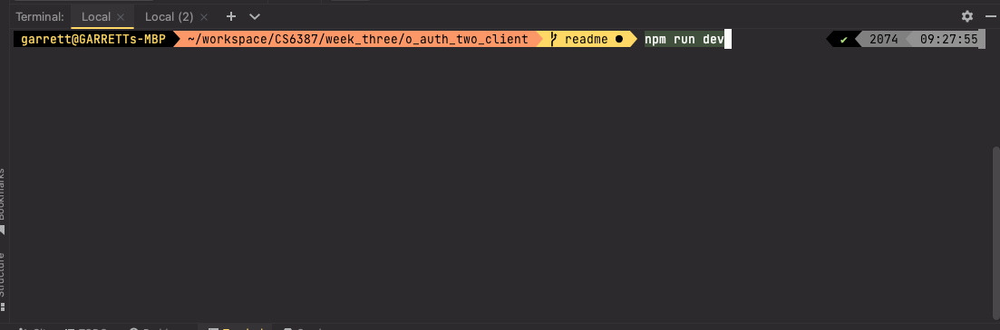
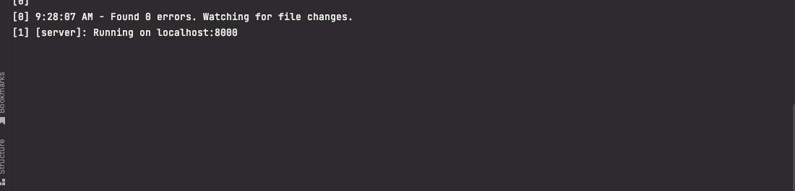
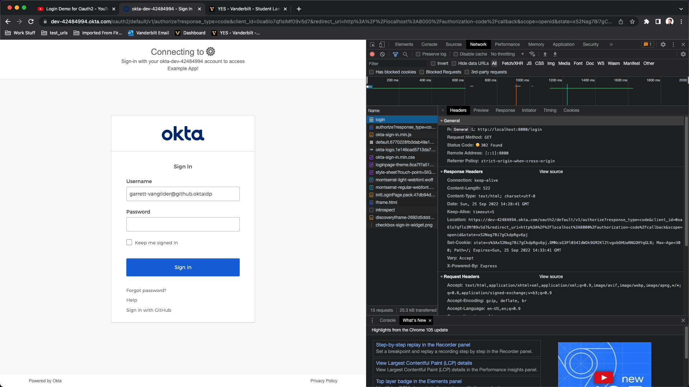
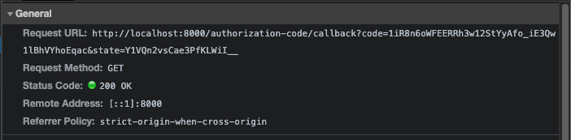
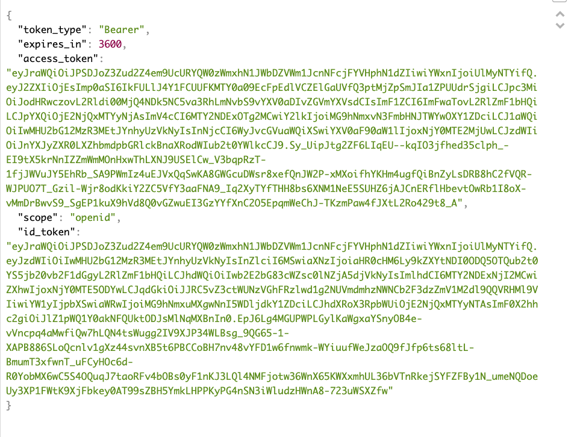

## OAuth 2 Client

This is an example client implementing Auth Code Grant (RFC 6749 section 4)

### Inspired by okta
- https://www.oauth.com/playground/authorization-code.html
- https://developer.okta.com/docs/guides/implement-grant-type/authcode/main/

## Login demo screenshots

Start the application with `npm run dev`

Client runs the app on port specified in `.env`

Visiting `/login` redirect user to okta login page

After logging in, user is redirected back to client with a login code and the state param to prevent CSRF attacks 

Tokens are populated by okta for the user and authentication is complete

